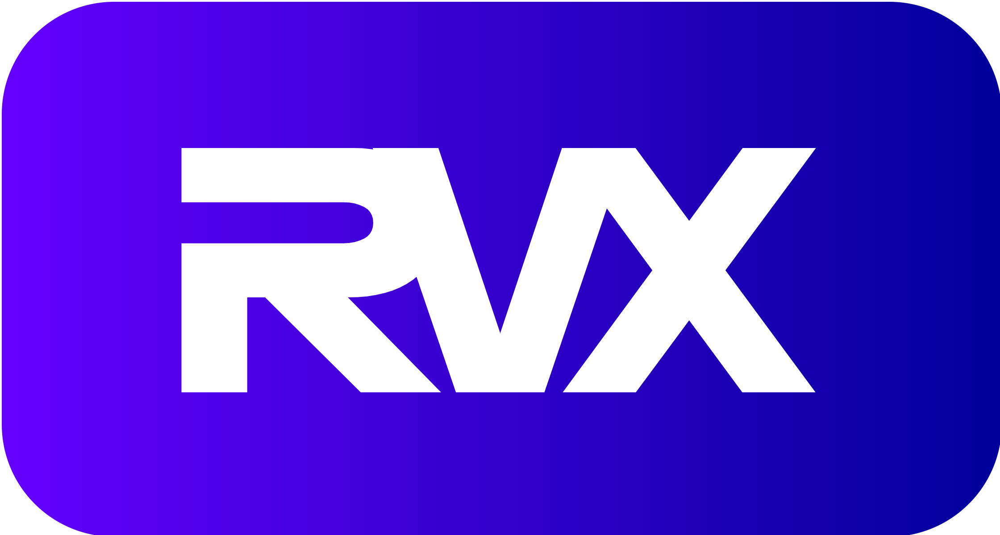

RVX is a microcontroller IP core developed in Verilog that implements the RV32I instruction set of RISC-V. It is designed for easy, seamless integration into embedded systems and FPGA designs, facilitating the rapid development of innovative RISC-V applications.

RVX can run real-time operating systems such as FreeRTOS, as well as bare-metal embedded software. Its design includes components such as memory, timers, and interfaces for UART, GPIO, and SPI communication, enabling RVX to integrate with a variety of sensors and actuators commonly used in embedded applications.

Check out [RVX Documentation][1].

## Get Started

The quickest way to get started is to implement one of the example projects on your FPGA. Check it out:

- [Hello World Example][2]
- [FreeRTOS Example][3]

See the [User Guide][4] to learn how to create your own applications.

## License

RVX is distributed under the [MIT License][5].

## Need help?

Please open a [new issue][6].

[1]: https://rafaelcalcada.github.io/rvx
[2]: https://rafaelcalcada.github.io/rvx/examples/helloworld
[3]: https://rafaelcalcada.github.io/rvx/examples/freertos
[4]: https://rafaelcalcada.github.io/rvx/userguide/
[5]: LICENSE
[6]: https://github.com/rafaelcalcada/rvx/issues