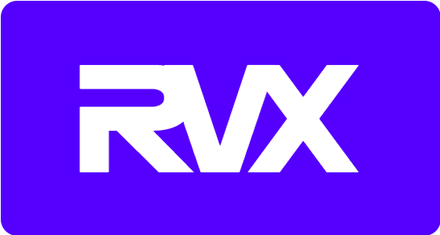

 <strong>Open-source RISC-V Microcontroller IP</strong>

## About the Project

**RVX** is a RISC-V microcontroller written in Verilog for embedded, FPGA, and ASIC applications. It offers a rich feature set while remaining easy to integrate, enabling rapid development of RISC-V systems — from FPGA prototypes to custom ASICs.

- **RISC-V ISA** — Implements the RV32I integer instruction set and the Zicsr and Zmmul extensions.
- **Verified** — Tested with the [RISC-V Tests][1] framework.
- **Software Development Kit** — The [RVX SDK][13] provides a complete embedded software stack, including peripheral drivers, startup code, linker scripts, and build integration.
- **FreeRTOS** — RVX can run FreeRTOS, enabling multitasking and real-time capabilities.
- **Built-in Peripherals** — Includes I2C, SPI, GPIO, and UART controllers and drivers.
- **Easy to Integrate** — Integrates cleanly into FPGA and ASIC workflows.
- **Portable** — Avoids vendor-specific constructs to ensure portability across synthesis tools.
- **Documentation** — Includes [Developer Guide][2], [IP Reference][3], and several [Example Projects][5].

## Getting Started

The fastest way to evaluate RVX is to build and run one of the example projects for your FPGA board.

If you are new to RVX, we recommend starting with the [Hello World][6] example. It demonstrates how to build and run a simple "Hello, World!" program for RVX, introducing the RVX toolchain and development workflow.

Each example contains:

- Step-by-step build and run instructions
- Complete RTL and software source code
- Pre-built FPGA bitstreams for featured boards

## Examples

- [Hello World][6] - Introduces the RVX toolchain and development workflow with a simple "Hello, World!" program.
- [FreeRTOS][7] - Runs FreeRTOS on RVX, showcasing multitasking and real-time capabilities.
- [UART][8] - Demonstrates serial communication using the UART controller.
- [SPI][9] - Demonstrates how to communicate with SPI devices using the SPI controller.
- [I2C][10] - Shows how to interface with I2C devices using the I2C controller.
- [GPIO][11] - Digital input/output control using the GPIO controller.
- [Timer][12] - Demonstrates the use of the built-in timer controller for timekeeping and scheduling.

## Documentation

The documentation for RVX includes:

- [Developer Guide][2] — Guide for developing software applications for RVX.
- [IP Reference][3] — Documentation for the RVX design, including architectural overview, source files, configuration parameters, I/O signals, and memory map.
- [Example Projects][5] — Complete source code and instructions for building and running the example applications.

## License

RVX is free and open source, distributed under the [MIT License][14].

[1]: https://github.com/riscv-software-src/riscv-tests
[2]: https://rafaelcalcada.github.io/rvx/devguide
[3]: https://rafaelcalcada.github.io/rvx/design
[4]: https://rafaelcalcada.github.io/rvx/api
[5]: https://rafaelcalcada.github.io/rvx/examples
[6]: https://rafaelcalcada.github.io/rvx/examples/helloworld
[7]: https://rafaelcalcada.github.io/rvx/examples/freertos
[8]: https://rafaelcalcada.github.io/rvx/examples/uart
[9]: https://rafaelcalcada.github.io/rvx/examples/spi
[10]: https://rafaelcalcada.github.io/rvx/examples/i2c
[11]: https://rafaelcalcada.github.io/rvx/examples/gpio
[12]: https://rafaelcalcada.github.io/rvx/examples/timer
[13]: https://github.com/rafaelcalcada/rvx-sdk
[14]: LICENSE