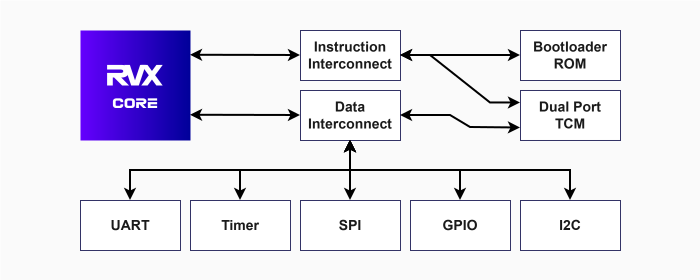

This document provides an overview of the design of RVX, including its architecture, source files, configuration parameters, I/O signals, and memory map. It is intended for RTL/hardware engineers who want to understand the internal workings of RVX, how to integrate it into their designs, or how to start a new RTL project for RVX.

!!! note ""

    :octicons-info-24: For information on how to develop software applications for RVX, see the [Developer Guide](devguide.md).

## Overview

RVX is a RISC-V microcontroller IP core written in Verilog for embedded, FPGA, and ASIC applications. It is built to be simple to integrate while offering a rich feature set, enabling rapid development of RISC-V systems — from FPGA prototypes to custom silicon.

## Standards

RVX implements the following modules of the RISC-V specifications:

- the RV32I Base Integer Instruction Set, v2.1
- the Zicsr Extension for Control and Status Register (CSR) Instructions, v2.0
- the Machine-Level Privileged ISA, v1.13
- the Zmmul Extension for Integer Multiplication, v1.0

RVX is implemented in Verilog (IEEE Std. 1364-2005) and is compatible with any Verilog-compliant synthesis and simulation tools.

## Architecture

RVX is built around a simple, modular architecture, consisting of a central processing unit (RVX Core), a communication fabric (RVX Interconnect), and various peripheral modules. The central interconnect provides low-latency communication between the processor core, memory blocks, and peripheral modules, ensuring efficient data transfer and system performance.

The main components of RVX are listed in the table below.

<p align="center"><caption><strong>Table 1.</strong> Main components of RVX</caption></p>

| Component | Description |
|-----------|-------------|
| **RVX Core** | The central processing unit that implements the RISC-V ISA and executes software applications. |
| **RVX Interconnect** | A communication fabric that connects the RVX Core to the peripherals and memory, providing low-latency access to these components. |
| **Tightly Coupled Memory (TCM)** | A high-speed memory block with low access latency and configurable size, tightly integrated with the RVX Core through the RVX Interconnect. |
| **Bootloader ROM** | A small read-only memory that contains the bootloader program responsible for initializing the system and loading the application code into the TCM memory. |
| **UART Module** | Provides a standard UART interface for serial communication, allowing RVX to send and receive data over a serial connection at configurable baud rates. |
| **GPIO Module** | Provides a configurable number of general-purpose I/O pins that can be used for interfacing with external devices such as sensors, actuators, or other digital components. |
| **SPI Module** | Provides an SPI interface for communicating with external SPI subordinate devices, such as flash memories and sensors. |
| **Timer Module** | Provides a simple timer peripheral that can be used for generating periodic interrupts or measuring time intervals in software applications. |

The figure below shows a high-level block diagram of the architecture of RVX, illustrating these components and their connections:

<figure markdown="span">
{ width=100% }
</figure>
<p align="center"><caption><strong>Figure 1.</strong> RVX Architecture Overview</caption></p>

## Source Files

The Verilog source files of RVX are located in the [`rtl/`](https://github.com/rafaelcalcada/rvx/tree/main/rtl) folder of the repository. When integrating RVX to your design, make sure to include all the files in this folder (including the files in its subdirectories).

The table below provides an overview of the organization of the `rtl/` folder:

<p align="center"><caption><strong>Table 2.</strong> Organization of the <code>rtl/</code> Folder</caption></p>

| File/Directory | Description |
|---|---|
| **`rvx.v`** | The top-level module of RVX, which instantiates and connects all components of the design. |
| **`rvx_constants.vh`** | Verilog header file that defines constants used by all modules, such as memory addresses, register offsets, and configuration options. |
| **`core/`** | Directory containing the Verilog source files for the RVX Core. |
| **`interconnect/`** | Directory containing the Verilog source files for the RVX Interconnect. |
| **`memory/`** | Directory containing the Verilog source files for the TCM memory and the Bootloader ROM. |
| **`peripherals/`** | Directory containing the Verilog source files for the UART, GPIO, SPI, and Timer modules. |

## Top Module

The top-level module of RVX is located in the `rtl/` folder and is named `rvx.v`. It instantiates and connects all components of the design, including the RVX Core, the RVX Interconnect, the TCM memory, the Bootloader ROM, and the peripheral modules.

### Instantiation Template

The code snippet below shows a template for instantiating the top-level module of RVX. Make sure to adjust the configuration parameters and connect the I/O signals according to your design requirements.

Detailed information about the configuration parameters and I/O signals can be found in the following sections.

```verilog
rvx #(

    // Configuration parameters

    // The values shown below are the default values.
    // Adjust them as needed for your design.

    .TCM_SIZE_IN_BYTES      (8192),
    .TCM_BOOT_IMAGE_PATH    (""),
    .SPI_BOOT_IMAGE_ADDRESS (32'h00000000),
    .GPIO_WIDTH             (1),
    .ENABLE_ZMMUL           (0)

) my_rvx_instance (

    // I/O signals

    // Connect these signals to the appropriate signals in your design.

    .clock                  (),
    .reset_n                (),
    .uart_tx                (),
    .uart_rx                (),
    .sclk                   (),
    .mosi                   (),
    .miso                   (),
    .cs                     (),
    .gpio_input             (),
    .gpio_output_enable     (),
    .gpio_output            ()

);
```

### Configuration Parameters

The table below lists the configuration parameters of the top-level module of RVX. These parameters allow you to customize various aspects of the design, such as the size of the TCM memory, the number of GPIO pins, and the inclusion of optional features like the Zmmul extension.

<p align="center"><caption><strong>Table 3.</strong> Configuration Parameters of RVX Top Module</caption></p>

| Parameter name | Description | Default value |
|---|---|---|
| `TCM_SIZE_IN_BYTES` | Size of the TCM memory in bytes. Must be a power of 2 and, for FPGA implementations, must not exceed the available memory resources of the FPGA. | `8192` |
| `TCM_BOOT_IMAGE_PATH` | Path to a boot image (`.mem`) to be loaded into the TCM memory while programming the FPGA. Leave it empty for ASIC implementations. | `""` |
| `SPI_BOOT_IMAGE_ADDRESS` | Address in the SPI flash where the boot image is located. RVX bootloader will try to boot from an external SPI flash during system startup, and will look for the boot image at this address. | `32'h00000000` |
| `GPIO_WIDTH` | Number of general-purpose I/O pins provided by the GPIO module. Up to 32 pins are supported. | `1` |
| `ENABLE_ZMMUL` | Whether to enable or disable the Zmmul extension for integer multiplication. Set to `1` to enable, or `0` to disable. | `0` |

See the [Developer Guide](devguide.md) for more information about the [boot configuration](devguide.md#booting-rvx) parameters (`TCM_BOOT_IMAGE_PATH` and `SPI_BOOT_IMAGE_ADDRESS`) and how to [generate boot images](devguide.md#generating-the-boot-image) for RVX.

### I/O Signals

The table below lists the I/O signals of the top-level module of RVX. You need to connect these signals to the appropriate signals in your design when instantiating RVX top module. The I/O signals include the main clock and reset signals, as well as the interfaces for UART, SPI, and GPIO.

???+ note "Why are there input, output, and output enable GPIO signals?"

    The GPIO interface is exposed as three separate signals — `gpio_input`, `gpio_output_enable`, and `gpio_output` — rather than a single bidirectional bus. This is intentional: bidirectional (`inout`) ports cannot be used inside synthesizable RTL modules in a portable way. Providing separate input, output, and output enable signals for the GPIO interface allows RVX to be easily integrated into any design and synthesized with any tool, without running into issues related to bidirectional ports.

    Beyond portability, this approach gives you full flexibility over how the GPIO interface is implemented in your design. You can connect the three signals directly to FPGA I/O primitives, implement custom direction-control logic, or multiplex them with other signals in your system — all without any constraints imposed by RVX itself.

<p align="center"><caption><strong>Table 4.</strong> I/O Signals of RVX Top Module</caption></p>

| Signal name | Description | Direction | Width |
|---|---|---|---|
| `clock` | The main clock source. | Input | 1 bit |
| `reset_n` | Active-low reset. | Input | 1 bit |
| `uart_tx` | UART transmit. | Output | 1 bit |
| `uart_rx` | UART receive. | Input | 1 bit |
| `sclk` | SPI Clock. | Output | 1 bit |
| `mosi` | SPI Manager Out Subordinate In. | Output | 1 bit |
| `miso` | SPI Manager In Subordinate Out. | Input | 1 bit |
| `cs` | SPI Chip Select. | Output | 1 bit |
| `gpio_input` | GPIO input. | Input | `GPIO_WIDTH` |
| `gpio_output_enable` | GPIO output enable. | Output | `GPIO_WIDTH` |
| `gpio_output` | GPIO output. | Output | `GPIO_WIDTH` |
